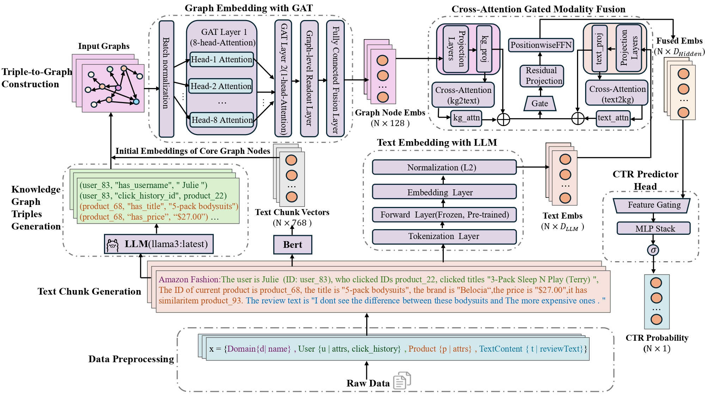

# Dual-Prompt-Driven Textual Knowledge Graph Generation With Heterogeneous Information Embedding for CTR Prediction

Official code for the EMNLP 2026 paper *Dual-Prompt-Driven Textual Knowledge Graph Generation With Heterogeneous Information Embedding for CTR Prediction*.

TKE4CTR reformulates multi-field categorical features as text and a task-specific knowledge graph. A frozen language model and a graph encoder produce two views of each sample. Cross-attention gated fusion aligns them, and a feature-gated prediction head estimates the click probability.

The overall framework is shown below.



The figure has four stages.

1. **Dual-prompt transformation.** Tabular fields are written into a text chunk. A local LLM then extracts triples, and each chunk is turned into its own subgraph.
2. **Dual-modality encoding.** GAT reads the subgraph. A frozen pretrained language model reads the same text.
3. **Cross-attention gated fusion.** The two embeddings are projected into a shared space, exchanged by bidirectional cross-attention, and mixed by a gate.
4. **CTR head.** A feature-gated MLP maps the fused vector to a click score.

## Data

Experiments use five domains of the [Amazon Review Data (2018)](https://nijianmo.github.io/amazon/index.html): All Beauty, Amazon Fashion, Digital Music, Gift Cards, and Musical Instruments. Samples are ordered by time and split into training, validation, and test. Ratings above 3 are positive. Review text and click history are used only when building the training split.

Processed tables, prompt text, text embeddings, and graph embeddings are kept under `datasets/amazon_review_data/`. Dependency versions are listed in `requirements.txt`. Knowledge-graph extraction expects a local Ollama service.

## Pipeline

Run commands from the repository root. The scripts follow the order of Figure 1. Paths and runtime options inside each script need to match the local data layout before a full run.

```bash
python src/data_preprocess/process_raw_data.py
python src/data_preprocess/data_cleaned.py
python src/data_preprocess/data_splits.py
python src/text_preprocess/data_texted.py
python src/text_preprocess/text_embedder.py
python src/kg_preprocess/kg_generator.py
python src/kg_preprocess/kg_embedder.py
```

CTR training is started from `src/main.py`. The main modes are joint text-graph fusion, text only, and graph only. Fusion and prediction-head choices are defined in `configs/config.py`. Logs, checkpoints, and result tables are written under `output/`.

## Layout

```text
figures/Fig1.jpg              framework diagram
configs/config.py             paths and model options
src/data_preprocess/          raw records, cleaning, and splits
src/text_preprocess/          prompt text and text embeddings
src/kg_preprocess/            triple generation and graph embeddings
src/models/                   fusion and CTR heads
src/main.py                   training entry
```

Code: [https://github.com/fxl9/TKE4CTR](https://github.com/fxl9/TKE4CTR)
